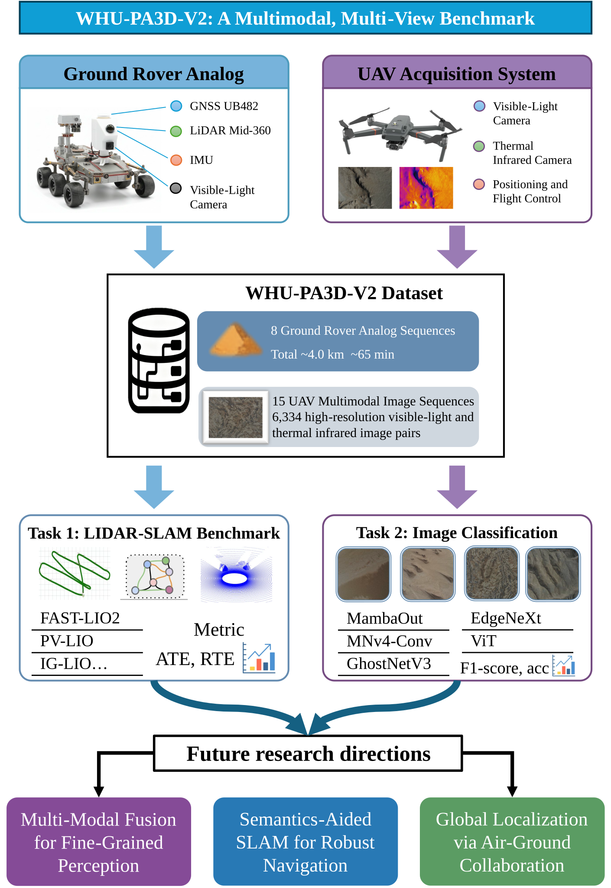
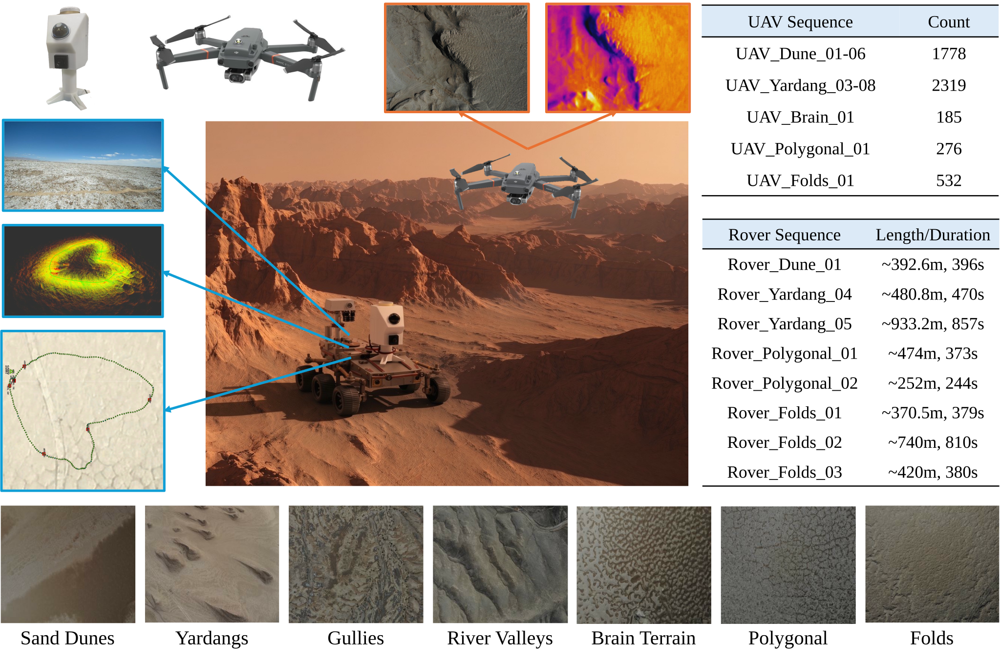
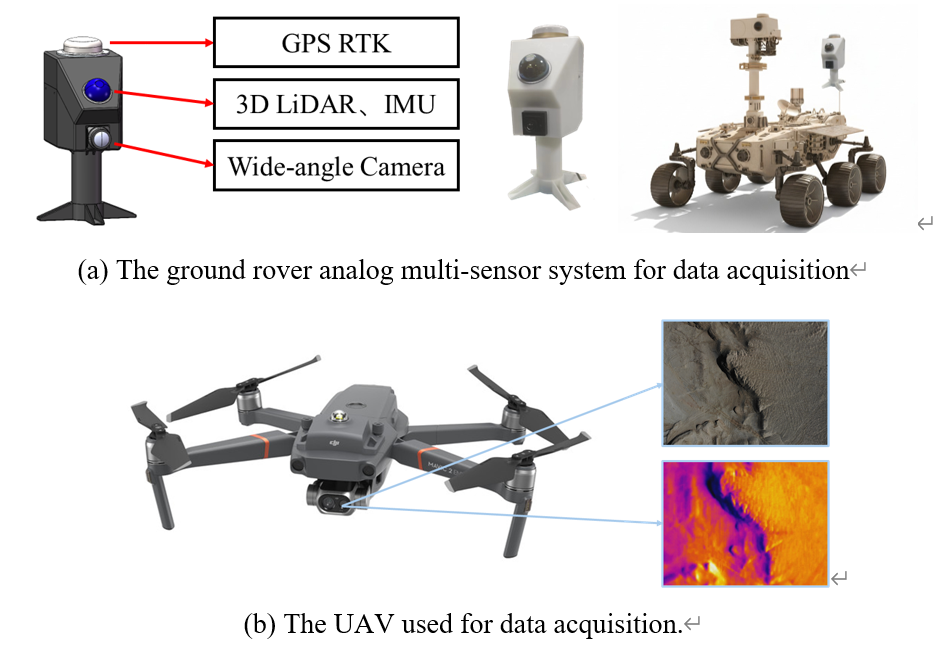

<h1 align="center">WHU-PA3D-V2</h1>

<h3 align="center">
  A Multimodal, Multi-View Benchmark for Aerial-Ground Robot Perception, Localization and Mapping in Planetary Analog  Environments
</h3>

<p align="justify">
  We introduce the WHU-PA3D-V2 dataset, which is designed for research in planetary perception, localization, and mapping in planetary-analog environments. The dataset was collected in the Qaidam Basin in China and is structured around a dual-platform approach that works together synergistically. The aerial platform is a multi-rotor unmanned aerial vehicle (UAV) that targets large-scale remote sensing. We collected image sequences over a total area of 3.59 km², including 6,334 synchronous, high-resolution, visible-light, and thermal infrared image pairs across seven distinct landform classes. The ground platform is a multi-sensor rover analog that targets close-range perception. It is equipped with a wide-angle RGB camera, a solid-state LiDAR, and an IMU. We recorded eight LiDAR point cloud sequences (4 to 14 minutes each, up to one kilometer) with high-precision, post-processing kinematic (PPK)-derived ground-truth trajectories.
</p>

<div align="center">
  
  <div>&nbsp;</div>
</div>

<hr/>

## Table of Contents
<details open>
<summary><b>Table of Contents</b></summary>

- [News](#-news)
- [Request Access](#-request-access)
- [Dataset](#-dataset)
  - [Overview](#1-overview)
  - [Collection Settings and Format](#2-collection-settings-and-format)
  - [Features](#3-features)
  - [Ground Rover Analog Sequences](#4-ground-rover-analog-sequences)
  - [UAV Image Sequences](#5-uav-image-sequences)
  - [Air–Ground Sequence Correspondence](#6-airground-sequence-correspondence)
  - [Data Structure](#7-data-structure)
- [Citation](#citation)
- [License](#license)

</details>

## 🆕 News
<!-- * 2025-03-22: The subset of our dataset is released! 🤩
* 2025-02-08: Accepted by TGRS! 🎉🎉🎉 -->
- 2026-09-24: Dataset access is now managed through a request form.
- 2026-09-23: The WHU-PA3D project page was published on GitHub.

## 🚧 Request Access
<p align="justify">
  To request access to the WHU-PA3D dataset, please complete the <a href="https://docs.google.com/forms/d/e/1FAIpQLSdXNAAdpTOKthjOQkxglEM1H4FCCekkjNWrpkD7gQcUPBPqHA/viewform?usp=header" target="_blank" rel="noopener noreferrer">dataset access request form</a>. Requests are reviewed by the dataset team, and approved applicants receive access instructions by email. The dataset includes 8 ground rover analog sequences (totaling over 4.0 km in trajectory length) and 22 UAV image sequences with 6,334 visible-light and thermal infrared image pairs across 7 planetary-analog landform classes. The dataset is provided under the terms acknowledged in the request form.
</p>

## 🔢 Dataset

### 1. Overview
<p align="justify">
  WHU-PA3D-V2 is a large-scale, multimodal, and multi-view benchmark designed for perception, localization, and mapping research in planetary-analog environments. It integrates a ground rover analog and an Unmanned Aerial Vehicle (UAV), both collected in the Qaidam Basin. The benchmark includes 8 ground rover analog sequences (about 4.0 km total, with high-precision PPK ground truth) and 22 UAV image sequences covering 3.59 km². Together, the aerial sequences contain 6,334 synchronized high-resolution visible-light and thermal infrared image pairs across 7 distinct landform classes. Its aerial and terrestrial perspectives and multimodal sensors (LiDAR, RGB, thermal, IMU, and GNSS/PPK) support robust SLAM, multimodal fusion, and air–ground collaborative localization research.
</p>

<p align="center">
  
</p>

### 2. Collection Settings and Format
<p align="justify">
  The WHU-PA3D-V2 dataset was collected using a collaborative dual-platform approach, integrating both ground and aerial systems. The ground platform simulates a planetary rover’s close-range perception. The aerial platform (multi-rotor UAV) simulates large-scale remote sensing. This dual-platform design provides a foundation for algorithms in air–ground collaborative perception and localization for planetary exploration. The following summarizes hardware configurations and sensor parameters.
</p>

<p align="center">
  
</p>

| Specification | Ground Rover Analog | UAV Platform |
|---|---|---|
| Visible-Light Camera | 1/2.8" CMOS, 140° FoV (1280×720 px) | 1/2.3" CMOS, 85° FoV (4056×3040 px) |
| Thermal Camera | — | Uncooled VOx Microbolometer (640×480 px) |
| Primary 3D Sensor | LiDAR (Livox MID-360), ~200k pts/frame @ 10 Hz, 360° H-FoV | — |
| Inertial Sensor (IMU) | Integrated (ICM40609), 200 Hz | — |
| Positioning System | GNSS PPK (RMS: H < 0.8 cm + 1 ppm, V < 1.5 cm + 1 ppm) | GNSS (GPS + GLONASS), H ±1.5 m, V ±0.5 m |

### 3. Features

- 🚜 Dual-Platform Acquisition: Ground rover analog + UAV
- 🌡️ Multimodal Data: LiDAR, RGB, Thermal Infrared, IMU, GNSS/PPK
- 🗺️ Diverse Landforms: Yardangs, dunes, polygonal terrains, tectonic folds, etc.
- 📍 Precise Ground Truth: Centimeter-level accuracy with PPK
- 🤝 Air–Ground Collaborative: Designed for joint perception and localization research
- 🧪 Benchmarks Included: SLAM evaluation + terrain classification models


### 4. Ground Rover Analog Sequences

| Sequence | Length | Duration | Description |
|---|---|---|---|
| Dune01 | ~392 m | 396 s | Solidified sand dunes, slope variation, no RGB imagery |
| Yardang04 | ~481 m | 470 s | Dense Yardang, feature-rich |
| Yardang05 | ~933 m | 857 s | Complex Yardang, multi-loops |
| Polygonal01 | ~474 m | 373 s | Polygonal terrain, micro-topography |
| Polygonal02 | ~252 m | 244 s | Polygonal terrain |
| Folds01 | ~370 m | 379 s | Fold terrain, illumination variation |
| Folds02 | ~740 m | 810 s | Fold terrain, mixed rich/flat |
| Folds03 | ~420 m | 380 s | Fold terrain |

### 5. UAV Image Sequences

The dataset contains 22 UAV image sequences covering 3.59 km² and 6,334 image pairs across seven landform classes. The sequence details below follow the latest paper; Yardang 08 is RGB only.

| Sequence | Count | Area (km²) |
|---|---|---|
| Dune 01 | 557 | 0.1658 |
| Dune 02 | 159 | 0.156168 |
| Dune 03 | 122 | 0.1163 |
| Dune 04 | 258 | 0.2189 |
| Dune 05 | 329 | 0.2489 |
| Dune 06 | 353 | 0.1820 |
| Yardang 01 | 63 | 0.0614 |
| Yardang 02 | 339 | 0.3255 |
| Yardang 03 | 279 | 0.2311 |
| Yardang 04 | 208 | 0.1674 |
| Yardang 05 | 140 | 0.0397 |
| Yardang 06 | 338 | 0.3270 |
| Yardang 07 | 608 | 0.5840 |
| Yardang 08 (RGB only) | 746 | 0.1788 |
| Gully 01 | 116 | 0.1330 |
| Gully 02 | 271 | 0.2970 |
| Gully 03 | 95 | 0.1193 |
| River Valley 01 | 217 | 0.2150 |
| River Valley 02 | 143 | 0.2063 |
| Brain 01 | 185 | 0.2061 |
| Polygonal 01 | 276 | 0.2634 |
| Folds 01 | 532 | 0.5083 |

### 6. Air–Ground Sequence Correspondence

To support air–ground collaborative perception and localization, UAV image sequences and ground rover analog sequences are geospatially co-registered.

| Ground Rover Analog Sequence | Corresponding Aerial UAV Image Sequence |
|---|---|
| Dune 01 | Dune 01 |
| Yardang 04, Yardang 05 | Yardang 08 (RGB only) |
| Polygonal 01, Polygonal 02 | Polygonal 01 |
| Folds 01, Folds 02, Folds 03 | Folds 01 |

### 7. Data Structure

The dataset is organized into two main categories: `Ground_Rover_Analog_Sequences` and `UAV_Image_Sequences`.

#### Ground Rover Analog Sequences

Each ground sequence is stored in its own directory. It contains a ROS bag file with sensor data and a `.txt` file with the ground-truth trajectory.

- `.bag` file: ROS bag with topics:
  - `/livox/lidar`: Point cloud data from the Livox MID-360 LiDAR.
  - `/livox/imu`: IMU data from the Livox MID-360's built-in IMU.
  - `/camera/image/compressed`: Compressed RGB images from the wide-angle camera.
- `.txt` file: Ground-truth trajectory; each line: `timestamp x y z qx qy qz qw`.

```
WHU-PA3D/
└── Ground_Rover_Analog_Sequences/
    ├── Dune01/
    │   ├── Dune01.bag
    │   └── Dune01_gt.txt
    ├── Yardang04/
    │   ├── Yardang04.bag
    │   └── Yardang04_gt.txt
    └── ... (and other sequences)
```

#### UAV Image Sequences

Each UAV sequence is stored in its own directory, containing visible-light (RGB) and thermal infrared images.

```
WHU-PA3D/
└── UAV_Image_Sequences/
    ├── Dune01/
    │   ├── DJI_0001.JPG
    │   ├── DJI_0002.JPG
    │   ├── DJI_0003.JPG
    │   ├── DJI_0004.JPG
    │   └── ...
    ├── Yardang01/
    │   ├── DJI_0001.JPG
    │   └── ...
    └── ... (and other sequences)
```

<hr/>

## Citation

If you use WHU-PA3D-V2, please cite:

```bibtex
@article{jin2025whu,
  title={WHU-PA3D: Qaidam Basin Planetary Analogous-3D Dataset},
  author={Jin, Ang and Chen, Chi and Xu, Yuhang and Cong, Yangzi and Wu, Weitong and Li, Liuchun and Li, Yifan and Yang, Bisheng},
  journal={The International Archives of the Photogrammetry, Remote Sensing and Spatial Information Sciences},
  volume={48},
  pages={725--730},
  year={2025},
  publisher={Copernicus GmbH}
}
```

<hr/>

## License

The [MIT License](LICENSE) applies to the files in this repository. It does not license the WHU-PA3D dataset distributed separately to approved applicants. Dataset access and use are governed by the terms acknowledged in the [dataset access request form](https://docs.google.com/forms/d/e/1FAIpQLSdXNAAdpTOKthjOQkxglEM1H4FCCekkjNWrpkD7gQcUPBPqHA/viewform?usp=header).
